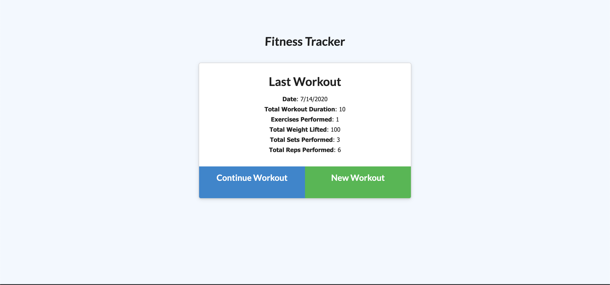
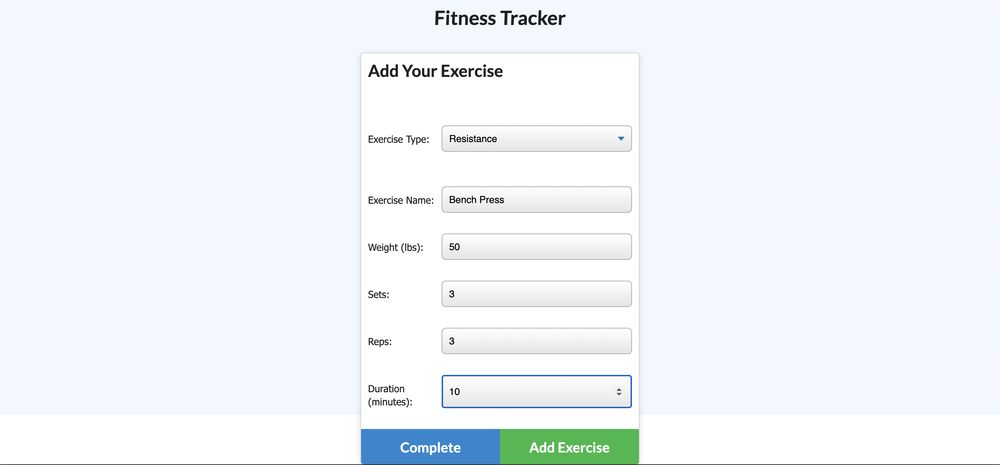
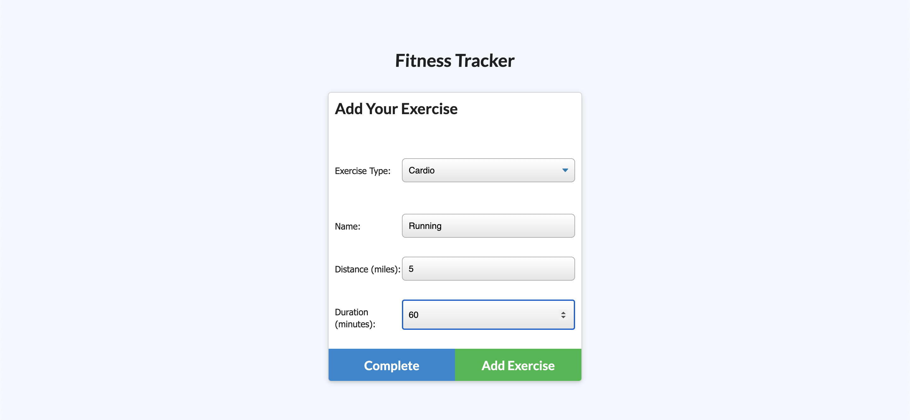
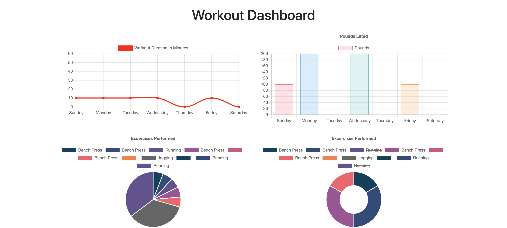

## **Workout-Tracker**
------

## **Live Link**

<h2><a href ="https://drive.google.com/file/d/1krAJq6FwTvu2QtY0YTb8PF8riV662ALl/view">Live Link</a></h2>

## **Description**
This is an app that keeps track of a users workouts. The user is able to add exercises to a previous workout plan and add new exercises to a new workout plan. The app allows a user to log either a resistance or a cardio workout. For a resistence workout a user is able to track the type of exercise they did, total duration, weight lifted, sets and reps completed. For cardio workouts the user is able to track the type of exercise they did, the total duration and total distance of their workout. On page load, the user will see their previous workout this is because their tracked workouts are stored in a database. The user can veiw thier workout stats for the week on the app dashboard. 

## **Technology Stack**
* HTML 
* CSS
* Express.js
* JavaScript
* Node.js
* MongoDB
* Mongoose
* Heroku
* GitHub

## **Screenshots**

## **Test**

  

## **Usage**

This application allows a user to keep track of their workouts and progress. 

## **Contributors/Contact**

#### **Jessica Helft** 
* [@KingKitty89](https://github.com/KingKitty89)
* [Portfolio](https://kingkitty89.github.io/ResponsivePortfolio/)
* [jessicahelft@gmail.com](jessicahelft@gmail.com)
* [LinkedIn](https://www.linkedin.com/in/jessicahelft)
